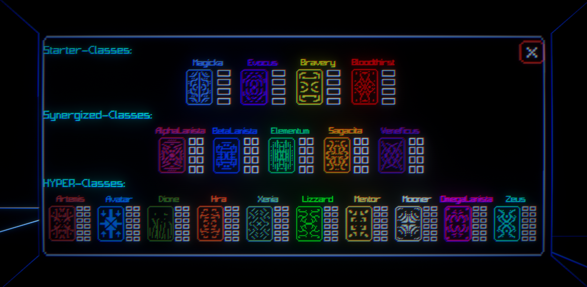

# Devlog

**This is a log of my entire development process of HYPER.**

## Day 1

Day 1 is as simple and dry as it can get. Creating the repository, project and just analyzing the concept.

## Day 2

Made the groundworks of the player today: movement, camera look, all that.
Movement is almost done.
The movement is very similar to ULTRAKILL, but that's not intentional and is only because ultrakill just generally has good basic movement mechanics.
As I have stated in the description of the game, you will be able to upgrade your weapon with many different items.
Not only that, but certain items are categorized in different **classes**.
Classes can be synergized to create **synergized classes**.
Haven't thought a lot about the classes, so I'll think about them more on the following days.

## Day 3

Completed the movement. 
You can slide, jump, wall jump, ground slam, dash and, of course, walk.
Haven't implemented a limit to the wall jumps or a cooldown for the dash but I will do it eventually.
I took some time to think about the gameplay and here's what i'm thinking:
Of course, there will be the Arena, where you fight enemies in waves, but once the round ends, you go to the **Shop**.
The Shop is where you buy your upgrades. The upgrades are categorized in certain classes.
There are starter classes, synergized classes and HYPER-classes. Starter classes are what you start with, synergized classes can only be crafted with two starter classes.

### **STARTER CLASSES:**

1. INSANER (dps)
2. WARRIOR (defense)
3. MAGICIAN (magic)
4. SUMMONER (summoning stuff)

### **SYNERGIZED CLASSES:**

1. JUGGERNAUT = INSANER + WARRIOR 
2. WIZARD = INSANER + MAGICIAN 
3. ELEMENTOR = WARRIOR + MAGICIAN 
4. ALPHA TRAINER = INSANER + SUMMONER
5. SIGMA TRAINER = WARRIOR + SUMMONER
6. BETA TRAINER = MAGICIAN + SUMMONER

### **HYPER-CLASSES:**

idk :p

That's it for today.

## Day 4

So today I did a little bit of both analyzing gameplay and working on the game mechanics.
I made a quick weapon model in blender and put it together in Unity.
I also implemented some sort of inertia to the gun, so that whenever you move, it would sort of react to your movements by being slightly dragged.
And also shooting is semi-done, I only implemented the recoil and stuff, but yeah.
Very cool :)

Besides that, I also implemented some more important mechanics, those being the upgrades and the classes.
Though it's a VERY early prototype, so of course it's likely to change many many times.
That being said, here's an update on the classes:

So as you may know, upgrades are categorized in different classes (thought some upgrades can be categorized into two classes as well). Once you’ve had max items in a certain class, you can choose to synergize the class with another one (that you've also had max items), creating a synergized class. 

Each class has its own upgrade pool, but many upgrades can overlap with each other. Once you’ve upgraded to the synergized class, the game will randomly choose X/2 upgrades from the class’ upgrade pool to give you, where X is the class’ max amount of upgrades. Getting upgrades that overlap with another class that you don’t have requires you to sacrifice a starter class (if you have one, because they start getting pretty rare later, because of the item pool getting bigger).

With Starter classes, the max items there are on all of them is 4.
With Synergized classes, the max is 8.
And with Hyper classes, the max is 16.

I'm not gonna tell you the HYPER classes right now, but once they are done I will show.
Forgot to mention but HYPER classes can be crafted with synergized classes and any starter class.

But yeah that's it for today I'm kinda tired. 

## Day 5

Couldn't do anything to the game today for a few private reasons, but I did think about an important part of the whole structure of the game: the **Upgrade System**.
Here's how the Weapon System and the Upgrade System co-operate together:

The Weapon System contains Weapon stats and Weapon info. Weapon stats include stuff like bullet damage, fire rate, etc.
Meanwhile, Weapon Info includes members and methods like OnShoot(), current bullet pool, etc.
The Upgrade System has two types of Upgrades: Modifiers and Addifiers.
Modifiers modify the Weapon Stats, while Addifiers use stuff from Weapon Info to add stuff.
There's also the Upgrades class, which creates the Upgrades upon start-up and collects them in an array.
I'm still not too sure about this though, so expect things to change a lot.
I'm already thinking of making them scriptable objects... idk, anyway yeah that's it for today.

## Day 6

Added a new ability to the movement: lock.
You can lock yourself midair for a brief moment. Very cool imo.
I made a lot of changes in the upgrade system, realized scriptable objects don't really work well with what i'm trying to do, so instead i will just make each upgrade a prefab.
But yeah all around I just did some small refactoring and semi-implemented the upgrade system. It's really tough though because I have to make it versatile enough that it would satisfy my creativity.

A good example to what I am trying to do here is the Unity's Particle System. It has modules, that do different stuff and you can enable and disable them.
Unfortunately I don't think I can do the same thing the Particle System did, so I'm going for a different solutions.
I came up with different behaviours that upgrades will have in their prefabs.
There are Player, Bullet and Weapon behaviours. 

Anyway's I'm tired as hell so i'm just gonna buh bye.

## Day 7

Not a lot, just improving movement, getting rid of the static WeaponInfo class, because i just didnt have a great feeling about it, also created actual prefabs for the gun parts.
Also, i made the gun screw rotate 90 degrees when you shoot, looks very cool imo.
Again, didn't do anything crazy yet because I'm planning on thinking out the upgrades and shit, so yeah. There will be like 28 upgrades absolute minimum, so there's a lot to come up with.

## Day 8

Slow but steady progress.
That's all I gotta say.
Been focusing on some other projects lately.
Still devoted to making changes every day even if it's gonna be small.

Anyway i came up with the last few HYPER classes and some upgrades so yeah.
**Here's the complete list of classes:**

### STARTER CLASSES:

1. INSANER (dps)
2. WARRIOR (defense)
3. MAGICIAN (magic)
4. SUMMONER (summoning stuff)

### SYNERGIZED CLASSES:

1. PENETRATOR = INSANER + WARRIOR 
2. WIZARD = INSANER + MAGICIAN 
3. ELEMENTOR = WARRIOR + MAGICIAN 
4. ALPHA TRAINER = INSANER + SUMMONER
5. SIGMA TRAINER = WARRIOR + SUMMONER
6. BETA TRAINER = MAGICIAN + SUMMONER

### HYPER-CLASSES:

(16 items max on all)
SC means Starter Class

1. ZEUS = SC + PENETRATOR + WIZARD
2. DIONE = SC + PENETRATOR + ELEMENTOR
3. ARTEMIS = SC + PENETRATOR + ALPHA TRAINER
4. AVATAR = SC + PENETRATOR + SIGMA TRAINER
5. HEKATE = SC + PENETRATOR + BETA TRAINER
6. LIZZARD = SC + WIZARD + ELEMENTOR
7. XENIA = SC + WIZARD + ALPHA TRAINER
8. GRINDER = SC + WIZARD + SIGMA TRAINER
9. MOONER = SC + WIZARD + BETA TRAINER
10. MENTOR = SC + ELEMENTOR + ALPHA TRAINER
11. BALLER = SC + ELEMENTOR + SIGMA TRAINER
12. HEPHAESTUS = SC + ELEMENTOR + BETA TRAINER
13. KAPPA TRAINER = SC + ALPHA TRAINER + SIGMA 14. TRAINER
15. INTER TRAINER = SC + ALPHA TRAINER + BETA TRAINER
16. LAMBDA TRAINER = SC + BETA TRAINER + SIGMA TRAINER

### A LITTLE BIT ABOUT ITEMS...

There are probably gonna be MINIMUM 28 upgrades and MAXIMUM 56.
The upgrades' class type(s) will overlap with each other to add more complexity and replayability.
Upgrades can modify or add to the player, the gun, or the bullets the gun shoots.
That's it lol.

## Day 9 

I did a bunch of stuff today! I made the base for the arena, i messed a bit with the graphisc (which resulted in some unfortunate circumstances) and i also fixed some more stuff with the movement.
Pretty happy with everything right now :)

Tomorrow I will try to make the arena better and also try to make the first few enemies. I have no idea how I will do it, these enemies will probably require AI and stuff...

I have an idea about how the player will transition from the arena to the shop. Initially, I had the idea of just making a vault door that would open and close if the round ended or you went inside the arena.
But now I think I'll just make like a tower thing in the middle of the arena that will have a minecraft beam shoot up at the sky, and once you complete the round, the beam will become white ig and will teleport you to the shop once you touch it. In the shop there will be a similar beam that you can also touch to got to the arena for the next round.

Also i made a custom skybox, which i will have to make more high quality cuz it sucks rn. Anyway yeah things are going smoothly right now :)

Here's a preview of the arena btw:

## Day 10

Not a lot today, was focusing on other projects. I thought this was gonna be the day that I can relax but NOPE. 

Felt a little bit bad that I didn't do anything today so I actually tried to do a few stuff. So I wanted to kind of finish the movement once and for all, so i implemented the dash cooldown and the jump limit.
I also kinda played a bit with the particle system to do some effects for when the bullets collide, so yeah. That's pretty much everything I did today. 

Tomorrow I'll actually get to making the first enemy, and also start decorating the Arena with stuff, should be fun.

## Day 11

Didn't even open Unity today :/ Lately my sleep schedule hasn't been the best, but I will try to improve it in the following days.

Sorry.

## Day 13

Didn't have time yesterday to commit, but hey im back.
I made a quite some stuff today that were kind of a pain to do...
I made the first enemy, and made him shoot missiles that will break into pieces if you shoot them.
Also made the gun have a shoot sound effect so yeah lol.
That's it i gotta do some other stuff right now so yeah, cya.

## Day 14

Sorry but I've been busy with irl stuff. I'm still extremely commited to this so I still tried doing some progress even though I can't code atm.

So I've analyzed the gameplay more, so now basically there is gonna be this mechanic that will basically let you gain back lost health. 
So basically, when you kill a lot of enemies in quick succession, you get a bonus depending on how many you killed. This bonus gives a boost to your stats and you gain back some health.
Kills that are not caused from your weapon do not count.

I think this will lead to some interesting dynamics! Can't wait to implement it as well as all the other enemies and upgrades and the shop and... a billion more stuff. 
It's overwhelming but I always like to step back, regain my footing, breathe, focus and think that it's all gonna go fine :)

I've been writing all the upgrades btw, I finished the starter class items, but I'll give the full list once I'm done with them.
In the meanwhile here's a little bit about the synergized classes:

Penetrator has a lot of high dps and high defense stuff, but he doesn't have any health or backup to help him out when he needs it the most.

Wizard has high dps and has a lot of variety of attacks, but he can be very vulnerable without proper handling of his techniques.

Elementor has good defense and attacks, but he relies a lot on being precise and focusing.

Alpha trainer has good backup and dps, but can be left vulnerable very quickly if you aren’t careful enough.

Sigma trainer has good defense and backup, but he’s not very equipped.

Beta trainer has good backup with good attacks that mostly cover him, but his lack of defense leaves him very vulnerable at the beginning.

Aight buh bye :p

## Day 15

Changed the skybox, much better now.

## Day 16

Pretty happy with what all I've done today. I refactored the enemy code, practically finished the first enemy, and set up some stuff for the futures enemies, which will definitely speed up the development process quite a bit. I added the a lil pedastol thing that will have a beam that expands to infinity at the center. This beam will act as a means of teleporting to the shop after the round ends. The same beam will exist in the shop to teleport you to the arena. 

I also made the missile homing, so yeah that's neat.

All in all I just did some really important-for-the-future enemy stuff. 

I'm planning on adding a melee attack, and another movement mechanic tomorrow. I'm also planning to start making the shop in the following days. I'm probably gonna do UI wayyy later. Prolly like in the middle to the end of the next month. Anyway yeah I'm pretty satisfied with what I've done today so yeah cya tomorrow :>

### OH I FORGOT TO MENTION...

I've thought of something, so at the start of each run, you will be asked to choose an "echelon". Echelons determine a lot of stuff, including: your bullets per shot, your passive item pool, and what active/class items will be excluded from the whole item pool. These echelons serve the purpose of reinforcing the idea of already having a build in mind. You cannot change your echelon during the run.

**The echelons are as follows:**

1. SINGULARITY: You can only shoot 1 bullet.
2. DOUBLE-STANDARD: You can only shoot 2 bullets. All their bullet stats split in half.
3. CERBERUS: You can only shoot 3 bullets. All bullet stats equally shared.
4. TETRAHEAD: You can only shoot 4 bullets. All bullet stats equally shared.
5. CINCOS: You can only shoot 5 bullets. All bullet stats equally shared.

Aight now buh bye.

## Day 17

I'm tired. Not because of game development I just had a rough but fun day lol. So here is what I did today:

I fixed some shader stuff, not completely, but mostly. I added the new movement mechanic I was talking about and I also added an glass amphitheatre-type roof over the the arena to make sure that the player doesn't escape. I completely finished the first enemy, which is called "Ether". It's a floating icosphere that shoots a missile at your direction. Shooting the missiles cause them to break into pieces (cool). Also I don't know if I said this already, but I made the beam in the middle that That's it lol.

I have a very modular system for the enemies, which is probably what I will also do for the upgrades. I'm going to do the shop tomorrow though and I will also try to completely fix all the shader problems (there's only one, actually, at least I think so..).

Anyway yeah it was pretty fun today, haven't put much thought into anything lately but I feel better when I don't overthink it.

Anyway I will go to sleep soon so cya.

## Day 18

Added the melee attack I was talking about, I was thinking of making it a punch, but it turned out to be more if a karate attack lmao. I like it, was pretty fun making it and animating it. Learned about rigging models as well today. Other than that I also tried to fix an issue with the shaders but I realized it was an issue with unity... So basically, Unity doesn't write to the depth buffer for materials that are on the "Transparent" queue, and my shader is using the "Transparent" queue to create the quad wireframe look. This means that anything the shader draws on the screen has no depth concept to it, meaning wireframes will be on top of wireframes no matter what. I think you can understand why this is bad. Apparently calculating the depth of transparent objects is very expensive... so Unity just doesn't, if I were to try and fix the issue, I would have to use completely custom shaders, and possibly custom render components... Imo I'm not gonna bother doing that, not because I'm bored (well maybe a bit) but because I don't think I'll have enough time to make those changes. I can't forget that it's a 3 month challenge. 

Anyway yeah that was a big paragraph lol, I'm gonna go now.

## Day 19

Didn't progress on the project today, I took a day off.

## Day 20

Painful day, but I'm so happy I got some really important things done.

The punch melee attack is done, implemented the sceen shake, and implemented player health bar. And also one thing that I'll mention in the end.

I pretty much put screen shake and some particle effects and debris upon punching an object/enemy. I like how the screen shake turned out, you just put in the strength of the shake, number of times you want it to happen, and the interval of each shake, simple. The player health system was the turning point, it was pretty painful to implement, because of all the things I was sub-implementing at once... BUT I did it :D.

Now let's talk about something...

I build the game, right? Playtesting it and all that, when I realized the game was acting differently in the build. I was befuddled, cunfuzzled, and quite possibly flabbergasted. I was trying to find the reason why it was happening, until it occured to me... ***All my scripts were framerate dependent.*** It was all framerate dependent because I wasn't using Time.deltaTime, or Time.fixedDeltaTime in their respective updates, which exist to keep things consistent despite framerate changes. I died inside for a brief moment, then went on to fix every single script I have made up until this point. 

Was it a really painful day? Yes. Do I feel whole-heartedly fulfilled after all that pain? Yes.

Anyway yeah I'm NOT touching this project any more for today lol.

Also 69 changed files committed LET'S GO.

## Day 21 

Didn't do a lot but I made the beam in the center of the arena teleport you to the shop, and i also set up the gameplay systems. So the systems are as follows: Round System > Wave System > Sequence System. And all of these systems depend on the Difficulty System for not only acquiring essential info but also incrementing the info so as to create difficulty progression.

1. Round System handles the round and initializing the wave system.
2. Wave System handles the waves in the round and initializing the sequence system.
3. Sequence System handles the sequences of enemies spawning in the wave.
4. Difficulty System and all of the above handle each other.

It's also worth mentioning that I organized some of the files and folders. Damn the game is getting big...

That's all yeah.

## Day 22 

Completed the gameplay loop, fully implemented, fixed a weird bug that is honestly unity's fault tbh. OnCollisionExit does not get called if you are colliding with an enemy constantly but then it suddenly dies, so the Movement class thinks that you are still colliding with the enemy, and this leads to some errors when trying to jump or slide. Fixed it though by checking if the other collider of the collision is null or not. If it is null, then you are most definitely airborne, and therefore can't jump or slide.

Anyway yeah things are going fine, but I still like haven't even done half of the game, which is kinda scary.

But uhh yep that's all, I'm not concentrating on the game so much because I want to finish some other stuff I've been working on for some time, but haven't had the time to finish them because of the game, lol.

Tomorrow I want to think of a few potential enemies, upgrades, etc. And also make the shop actually be a shop lol. Maybe I'll also think of some lore for the enemies as well lol idk.

## Day 23 

I didn't open Unity or matter of fact anything today. I did the unthinkable... I WENT OUTSIDE!! I touched GRASS! I made a staring contest with the SUN!! 

Jokes aside it was a fun day.

## Day 24 

I almost made the second enemy, I don't have time to finish it today. I changed the mesh for the particles, they look better now :] I also thought of some new items and stuff so yeah. Will explain tomorrow.

Anyway yeah, going to sleep now.

## Day 25

So I did some stuff, not a lot because the development today went frmo ok to catastrophic to can it get worse? to it got worse to ok again. I do not want to talk about it. Lol. I thought of some new items again, kind of reorganized the item list because it's getting concerningly big...

TOMORROW I am 102% sure that I will show you some of the new items and some more gameplay ideas that I've kept to myself for the past few days. But yeah that's all I gotta say. Bye !!

## Day 26

Okay jesus so I finally finished the new enemy, it's called Disco and it's a disco ball that bounces around the place, acting crazy and all that, while shooting a laser at you. However there are still problems with the graphics... I tried fixing them today, and felt like I was very close... But nothing worked. Contrary to my past opinion, I do think this transparency sorting problem can be fixed, some people have found solutions. I scoured the whole internet trying to find possible solutions, I EVEN WENT ON PAGE 2 OF GOOGLE. 

I found a promising solution, that practically wrote to the depth buffer first before all the rendering of the transparent objects, which actually makes sense kind of, however that didn't work... It thought it doesn't because maybe the render sorting is set to front to back, but I realized I was wrong, because the transparent queue renders back to front, soooo idk at this point what could be wrong. 

Anyway I feel like everything is a mess right now, primarily because of how I've set up the whole enemy system (it being a bunch of modules that you can assign to gameobjects). But honestly I don't know If I could do it any other better way (i probably could but whatever). I just like it this way because the code is very conveniently recyclable for other games I'm planning to make so yeah. I do have almost everything set up right now, which relieves me a lot, but there are still the upgrades to make. 

What I've thought about mostly though is of an interval event system thing. Which I commited myself to just because of how versatile it could be. Basically I imagined a module that has a timer that resets when it has reached a certain amount of time. Not only that, but it also invokes an event when it resets. This module has a t variable that is the current time divided by the interval, which gives a value from 0 to 1. This t variable is public and accesible. The main idea is that everything that requires doing something at a given interval will all depend on this singular module to tell them when to do something. This also lets us properly sync actions, which is very nice not to worry about. So things like Shoot(), but also, for example, ResetVelocity(), can be done at the same time by adding these as listeners in the interval event. Then, when the interval event is invoked, both will be called. I really like it this way and I think it's a good way to do things imo.

Anyway I just realized that it's July which kind of worries me because 1/3 of my time has passed for this challenge... and while I know a month since I started still hasn't technically passed, I still think I need to speed things up. I'm gonna go now though so yeah bye !!

### BY THE WAY

Downloading the project in this version will result in many missing prefabs probably, I've unpacked a lot of prefabs because of missing scripts warnings (that show up for no reason...) so yeah next version I will fix everything.

## Day 27

Pretty slow progress, mostsly due to me trying to make things flexible enough for the future. I feel like I learned a lot during these 27 days, like, A LOT. Not only about coding architecture, but also about graphics, shaders, game design, etc. It's just been a nice 27 days y'know. So I got stuck on this problem that I believe I have found the solution that wouldn't cause any other problems. Surprisingly, the solution not only involved making a script, but changing an existing script to make it better and more flexible, while being acceptable in my mind. 

The problem was, I wanted for particles to be colored depending on how the enemy was colored at that moment. This isn't as easy as it seems, however there are plenty solutions. One solution I thought of was to make an interface, with the function ColorParticle(Color color), and call it when instantiating the particle like this maybe: particleInstance.GetComponent<IColorParticle>()?.ColorParticle(color). But I quickly rejected that idea because particle instances are going to be pretty frequent and I would rather not to be calling GetComponent a lot of times, as it would probably reduce performance. Not only that but the idea wasn't all that entirely promising to me and didn't feel very intuitive. 

So I thought of some other stupid problems, until one solution stuck with me, which was to have the enemy be instantiated with deactivated particles that would be activated detached from the parent upon death of the enemy. This sounds good, because the particles are already instantiated and I could very easily imagine a script using OnEnable() function to set the particle system color to that of the color of the enemy. But of course there was another problem. I realized that my missile code was detaching all of the children upon death... All of them, including the particles. But wait, the missile isn't supposed to have any particles activating when they are dead, instead there are supposed to be fragments of them exploding, and only when it collides something it should activate the particles. 

So I thought about it until I realized the solution was extremely simple: just like I'm destroying gameobjects upon death, let's detach certain objects upon death! This fixes everything because now, it will not detach the particles upon death unless we put the particles in the array. 

Anyway I didn't have enough time to implement everything, tomorrow I will though, bye!!!!!

## Day 28 

Did the last finishing touche sot the discos enemy. These 28 days were fun. Here's a list of what I did:

1. Movement Mechanics
2. Graphics
3. 2 enemies
4. Attacking mechanics (melee, weaponry, etc)
5. Gameplay Systems (except difficulty progression)
6. Gameplay UI (except some small stuff like showing the current wave, current round, etc)

Yup, and a few sound effects I guess. So what now? I'll tell you what. This month, I need to do:

1. Sound effects
2. Rets of Gameplay UI
3. Difficulty progression
4. Shop layout/environment
5. More enemies
6. Upgrades

Seems like a fair amount of stuff I'd say. The next month I'll definitely start on like Main menus and all the UI.

I have an idea about the shop. Whilst playing the game, everytime you teleport to the shop, a new random little piece of decoration appears. I just think that would be kinda neat. Like just have an array of preplaced decorations that are all deactivated and one random out of all gets activated after each round.

### Also...

If I remember correctly on Day 25 I told you guys I'd tell you about some of the upgrades and gameplay ideas I had thought of. I completely forgot about it lol. Let me tell you about the gameplay idea I thought about:

So there will be these moments in the round called **Red Intermission** (might change the name later), that happen spontaneously and get more common as difficulty progresses. The arena becomes completely red and every enemy receives a random buff. Red intermissions only last about 10 seconds but you have to be very wary and cautious not to die. Feels like it would create some traumatic experiences on the person who is gonna be playing the game, and that is just what I want :)

Anyway I can't talk about the upgrades because they arent really done, it's pretty slow progress on that side but yeah.

Also I kinda reworked the melee script because of some weird bug. If I pressed F to punch it would lag for a second ONLY the first time, every other time it was fine, which is really weird tbh.

Anyway yeah bye.

## Day 29

So I made the gameplay UI, I made it show the current wave you're at and also whenever you teleport to the arena it pops up a floating message saying the current round. Pretty cool if you would ask me.

I also drew the shop layout and then just made the exterior in blender, here's a goofy ahh pic:

Anyway that's all for now. I'm planning on finally making the enemy health bars that were planned since i made the enemy health script (long time ago) and uh yeah. I also have been thinking about refactoring the cameraShake's code design... Like how it's applied and how I could make it better and more flexible. 

I know that I shouldn't constantly be thinking about flexibility too much, because that slows my progress, but I think when you hit the sweetspot and think just enough for it, the oppsoite actually happens. In my opinion, thinking about the flexibility for the future to its almost bare minimum (and still thinking about possible exceptions and how to cover them) is very important, because you prepare yourself and make it easier for your future self to handle things later down the road. I think this is just about thinking not only analytically, but also how your intuition feels about the things you implement, with regards to everything else. Sometimes though you have to be analytical instead of thinking intuitively.

Today I made the FadeMatColor more flexible to make it also applicable in TMP texts. Not only that, I also made this really cool (in my opinion) implementation, where you can choose if you want certain FadeMatColor color values to apply to your material, or whether you want it to apply the material's color value instead. This also let me slowly fade out the text showing the current Round number in the center, while still making it change color. I also had to make a change in the OnInterval script so that now it has the choice to self destruct once the interval has reached. I only did this because unity doesn't have a Destroy() function in the GameObject when picking for functions in the inspector in the UnityEvent, sooo yeah.

By the way, no progress on the upgrades :p Sorry... I just haven't really been very active with the game or with any of my hobbies. Maybe because I've like worked on the game these past 28 days for more than 6 hours a day. I mean, that's what happens when you set up a deadline that lasts 3 months haha.

Anyway yeah that's the end of day 29! With the amount of writing I'm doing, I'm prolly gonna write like 1200+ lines lol.

## Day 30

I advanced the CameraShake script, I ended up realizing that camera shakes are applicable in explosion, which means that it's also applicable in most particle explosions, so I don't have to change the code a lot because you can just add the camerashake on a particle and the shake just happens to the player's main camera. 

Anyway I wanted to implement the health bar but I ended up fixing another problem with the graphics that's kind of stupid to be honest. So for some reason that I am not fully aware of, the post-processing effects dont go by specific camera and happen in every camera even if it's not set to do that effect in the other cams. Currently I have 3 cams set, one for UI, that renders last, one for the weapon, which renders after the 3rd camera that hold renders all of the environment. 

So to fix this problem I'm basically creating 3 different render textures for each camera, and then I'm trying to combine all those renderTexture into one and then copy that into the main render texture that the player can actually view. The way I'm doing things though don't work, and I'm sure it's just a very small detail that I haven't picked up on.

## Day 31

I implemented the enemy health bar, it shows up below the enemy once you hit it and after some time it disappears. I fixed the problem with the render textures, almost. So now I CAN combine render textures with each other, but the problem is that it doesn't have a sense of depth. So it just looks like the texture has just been plasted onto the main texture, overlapping with objects in front of it.

I'm sure I'll find a fix or something.

I was importing the shop exterior blender mesh into unity, but after seeing how scuffed the mesh was with the wireframe material, i realized i could just make the whole shop in unity using scaled cubes, so that's what I'm doing now lol. 

I'm gonna show you guys a video of the game's current state soon, so stay tuned for that hehe.

## Day 32 

I was doing a lot of fiddling with the render textures and shaders, trying to find solutions but I decided fuck it and switched to the Universal Render Pipeline. I switched to URP because it lets me have different post-processing volumes for different layers (if i even remember correctly). I've had some past experience with URPs so it should aallll be fine. So I completely got rid of the custom post-processing files. Did I every mention I got the post-processing stuff from a great youtuber? Check him out: https://github.com/GarrettGunnell.

I made barebones prototype of the stats for the enemies and players. Yeah... I forgot that stats are actually gonna be really important and only today I remembered. 

It's been 32 days since this project started and I still haven't told you guys some of the very basics of the game. So let me present you:

### The Premise

**I will explain the following in sections:**
* The Gameplay
* The Movement Mechanics
* The Offensive Mechanics
* The Arena and the Interlude
* The Player Systems

### THE GAMEPLAY:

So, the gameplay consists of a single Round, that contains challenges that you must go through to survive. There are different types of Rounds. There are currently only **Endurance Rounds** and **Agility Rounds**, there are more planned though, as part of your S.P.E.C.I.A.L-TY ;)

**Endurance Rounds** last for a long time, consisting of multiple waves and sequences of enemies to survive. It's a test of Endurance, and it rewards you appropriately for your success in survival. You get points at the end of the Round plus bonus points depending on how much damage you've taken. 

**Agility Rounds** are quite the challenge, as they don't depend on systematic spawning of enemies. Instead, enemies spawn every single second. There are 3 pillars around the Arena that you have to destroy as fast as you can. Your agility pays off at the end of the round, as you get rewarded with points and bonus points depending on how much time it took you to finish the round.

Other than Rounds, there are also the Waves. Waves are a bunch of sequences of enemies. Each sequence has to wait for the other sequence to finish before starting. Finishing a sequence means killing all the enemies.

Other than Waves and Sequences, in every round, eventually, you will get what's called a **Red Intermission**. Red Intermissions happen almost at random and last for 10-15 seconds. The whole Arena becomes red and all the enemies temporarily get buffs to all their stats during the moment. It's as very nerve-racking and frightening moment, as it happens out of nowhere. 

### THE MOVEMENT MECHANICS:

You've got quite the arsenal of abilities on your hands in terms of movement mechanics. You can:
1. Jump (wall jump up to 3 times)
2. Slide
3. Ground slam while midair
4. Lock yourself in place while midair
5. Launch yourself outwards and inwards from the direction of your current position and the position from which you jumped from. Launching yourself will lead to bouncing up to 3 times (or 2? i dont remember lol)
6. Dash

### THE OFFENSIVE MECHANICS:

There are 4 offenseive mechanics in this game currently. Here's the list:

1. Gun, can range from short to long range depending on your choosing of echelons.
2. Punch, short range, very deadly.
3. Dynamite throw, medium range, pretty good, though you have a limited supply of them that regenerate every start of the round.
4. Minions, i guess?

### THE ARENA AND THE INTERLUDE:

**The Arena:**

The Arena is the place where you fight all the enemies, where the Round begins and ends, where you find yourself clenching both your butt cheeks as tensely as possible.
Every time you teleport to the Arena, it will get larger and larger, and new decorations will be places around to make it more interesting. 
The Arena will get larger so as to not cause a huge clutter in the later stages of runs. 
It just gives more room to breathe while also making the Arena feel fresh and open.

**The Interlude:**

The Interlude is a chill place that you teleport to from the Arena. It's a pretty chill place. In this place, you can go to the **Shop**. The Shop is where you buy your upgrades, increase your dynamite capacity, restore your health, all that. Moreover, there is also this small arcade machine-like building called the **Info-Room**. In this Info-Room, you can find info about all the entities of this planet. 
There is also this small underground room, that when you go in, feels like you're floating in space while you're eating some shrooms that you're not supposed to eat. Very psychedelic stuff. This room is important though, because this is where you get to choose your passive items. You won't always be able to choose a passive items, you can only choose after 3 rounds have finished, or something like that...

Also every time you teleport to the Interlude, a new piece of decoration will appear, no reason really, just why not lol.

### THE PLAYER SYSTEMS:

Here are the player systems:

**CLASSES:**

Classes are a VITAL part of the whole player system. Classes fall into 3 categories:
1. Starter Classes (4 max item capacity)
    - INSANER 
    - WARRIOR 
    - MAGICIAN
    - SUMMONER
2. Synergized Classes (8 max item capacity)
    - PENETRATOR = INSANER + WARRIOR 
    - WIZARD = INSANER + MAGICIAN 
    - ELEMENTOR = WARRIOR + MAGICIAN 
    - ALPHA TRAINER = INSANER + SUMMONER
    - SIGMA TRAINER = WARRIOR + SUMMONER
    - BETA TRAINER = MAGICIAN + SUMMONER
3. HYPER Classes (12 max item capacity)
    - ZEUS = SC + PENETRATOR + WIZARD
    - DIONE = SC + PENETRATOR + ELEMENTOR
    - ARTEMIS = SC + PENETRATOR + ALPHA TRAINER
    - AVATAR = SC + PENETRATOR + SIGMA TRAINER
    - HEKATE = SC + PENETRATOR + BETA TRAINER
    - LIZZARD = SC + WIZARD + ELEMENTOR
    - XENIA = SC + WIZARD + ALPHA TRAINER
    - GRINDER = SC + WIZARD + SIGMA TRAINER
    - MOONER = SC + WIZARD + BETA TRAINER
    - MENTOR = SC + ELEMENTOR + ALPHA TRAINER
    - BALLER = SC + ELEMENTOR + SIGMA TRAINER
    - HEPHAESTUS = SC + ELEMENTOR + BETA TRAINER
    - KAPPA TRAINER = SC + ALPHA TRAINER + SIGMA TRAINER
    - INTER TRAINER = SC + ALPHA TRAINER + BETA TRAINER
    - LAMBDA TRAINER = SC + BETA TRAINER + SIGMA TRAINER

By the way, SC means Starter Class.
Classes are important because upgrades are categorized into classes, and classes predefine certain builds. Upgrades may categorize in multiple classes and therefore will overlap with other upgrades. 

Starter classes are what you start with, synergized classes can be obtained by synergizing two starter classes. This unlocks the item pool of that synergized class, which consequently opens up more synergized classes that can be obtained by either synergizing two starter classes again or buying an item that contains the current class you have plus another one or two. HYPER classes can be obtained the same way, but you synergize synergized classes instead of Starter Classes. When synergizing classes, it will synergize the items as well, however it will only give you X/2 items randomly picked by the computer, where X is the max amount of items your class can have.

**ECHELONS:**

Echelons define not only the amount of bullets per shot you shoot, but also you passive item pool, and what class items are excluded from the whole item pool. Here are the list of echelons:

1. SINGULARITY: You can only shoot 1 bullet.
2. DOUBLE-STANDARD: You can only shoot 2 bullets. All their bullet stats split in half.
3. CERBERUS: You can only shoot 3 bullets. All bullet stats equally shared.
4. TETRAHEAD: You can only shoot 4 bullets. All bullet stats equally shared.
5. CINCOS: You can only shoot 5 bullets. All bullet stats equally shared.

Alright that's all I've spent like 2 hours writing this lol.

## Day 33

Switched back to the built in render pipeline because I realized that URP isn't compatible with the Post-Processing v2 package. Anyway so I basically fixed all of the materials because everything was broken. Yeah today was a big waste of time but oh well.

## Day 34 and 35

Couldn't commit yesterday because a huge wasp invaded my space and it was getting late anyway. BUT I am very satisfied with what I've done today. 

I made the gun have a muzzle flash when you shoot. Small but nice detail. I am planning on adding more details to the movement. Speaking of movement, I'm probably going to change the launch&bounce mechanic, to something a little different but with the same spirit nonetheless. I'm probably gonna make it so that you shoot out a zipline out of your arm and when it sticks to something you can use your scrolling wheel to either launch yourself inwards or outwards to that point the ziplinen stuck to. If you do nothing for 1 second the zipline will come back. So basically the controls are different plus a few other small things. But I'm basically just trying to turn this mechanic into something that would feel satisfying to execute.

I also made the missile enemy become red if eneough time has reached. That's all they're doing right now but soon they will also do some more exciting stuff. 

I think I changed a few other things but I can't remember them. I realized that the enemy modules are really not advanced enough for the enemies that I'm thinking, so I'm advancing them, trying to make them as flexible as creativity can be (well not that much but you get the point).

Oh I also implemented the stats for the enemies and for the player. I will implement the buffs soon. I also made some nice progress for the shop building. 
Here is a pic:

Anyway that's it for day 34 and 35, going pretty well, but I don't think I'll finish it in 3 months, I definitely overestimated my abilities. 3.5 - 4.5 months? Perhaps. But for my 2nd game it's going really well.

## Day 36

I re-implemented the launch movement mechanic. Now you throw a magnetic thing and when it sticks to a wall or ground you have 1 second to decide if you want to launch in or out, bouncing 3 times as you do so.

## Day 37

Reverted the re-implementation, kept some things. Made the health bar cooler, added ui elements.

## Day 38

I'm probably not gonna be doing a lot these following days.

## Day 39

-

## Day 40 and 41

I fixed some really, REALLY stupid things lol. Bugs that should not have been there. Anyway I made a trello board page to have all my to-dos in there to clear up my mind and stop keeping track of everything in samsung notes lol. I theorized some of the enemies, which was really fun. Lemme tell you some!

First of all, here's a list of all debuffs I've currently thought about:

1. Burning
2. Freezing
3. Poison
4. Rain
5. Blindness

Talking about the enemies, there will be organic and non-organic enemies. Organic enemies are immunne to rain, while non-organic enemies are immune to poison. The idea is that poison can't infiltrate a non-organic creature, but it can with an organic one. And with rain, it's the idea that non-organic cretures become rusty over time with rain, while organic creatures are fine.

Here are a few O and N.O enemies:

**Mog:** 
A non-organic creature that can only be described as having a glowy core with multiple rings rotating on it. These creatures stay on the ground because of how heavy they are. But because of this, they have an extreme sensitivity to vibrations in the ground. So when you touch it, they immediately start rolling towards you. If there are many of them and collide, they will create a huge explosion.

**Memoriam:** 
This non-organic creature is a one for all. It is the memories and hopes and feelings of all monsters. It can turn into anything. Because this creature is like a memory suspended in time, it cannot hurt you and you cannot hurt it. However, it can indirectly hurt you through your environment. It can manifest itself into whatever enemy it wants, and you have to endure it, until it goes away.

**Zorretox:** 
An organic wall of extremely compact intestines from the gluttony layer. It moves slowly, constantly spewing toxic liquid everywhere. 

**Siphan:** 
An organic creature that is half-plant half-animal. Because of its two mouths, it is able to blow the air constantly. When blowing, it also releases particles that communicate with each other. If a particle is disturbed, it will communicate with other particles close to it, reaching back to the siphan, which then starts fiercely suck the air until you reach its mouth, where you get damaged.

Here ya go :p

Also I just realized this is day 41 and not day 40 haha.

## Day 42

I've realized there is no way I'm finishing it in 3 months. It's probably gonna take me twice the amount that i thought it would. I don't mind though, but that probably means that I will not be doing daily logs. Instead I'll be logging my progress on a weekly basis. This is exactly the 6th week that has passed since I started development. 

Anyway now I'm making the movement particle effects and all that. I also realized that I can set the color of an instanced material in a 10x easier way, which is to just access the color variable of the material instead of using the function that requires the name that it has in the shader. Turns out if you put the [MainColor] attribute in a shader property or name the shader property _Color, this property will be the color variable of the instanced material that uses that shader. So that's cool and made my life easier.

Anyway there are a few bugs that I'm stuck on and don't know how to fix, so that's fun :)

I reflected upon my game a bit and thought about what would really make it fun. I came to the conclusion that your sheer evolution of becoming overpowered and the visual satisfaction of your power - with a big touch of strategic thinking and decisions that, if done right, will make you feel good about yourself - will make the game very satisfying and fun to play. I hope whoever is reading this can relate to this :]

I think it is obvious though that this game will be very fast paced and adrenaline-inducing.

On top of all that, the graphics make it really unique, as the 3D vector graphics genre has not been explored a lot. I think that's what's gonna grab the attention of many people, since the graphics are the most important first impressions a player gets from your game.

Anyway that's it for today. This week hasn't been the msot productive, and I know that I should be more disciplined with my development and more consistent, so I will do better.\

## Week 7 & Day 50

Here's what I did:

> I added a shield system. You can have a certain namount of shields and once you get hit, they break. The more you have, the bigger the damage reduction.
> I semi-finished the immune and bacteria (buff and debuff) system.
> Making the immune system also allowed me to categorize enemies as organic or non-organic.
> I made some more scripts use stats. Also change the way the stats work. Now each stat has its own lasting duration.
> Fixed right mouse button throwing error.
> Made the in and out launch direction be shown as two arrows in the bottom of the ui screen.

All of that was pretty trivial to do. However, there was one thing, that took HALF of my week. For that half of the week I was in pain, trying to figure out how to implement this. Of course, this thing is graphics-related. 

I wanted to do object pixelization, that being pixelating specific objects in runtime. This is harder than you think. First of all, it is very hard, almost impossible to do this. It's not just hard in a specific case, IT'S HARD IN EVERY SINGLE CASE. Why? BECAUSE UNITY. 

It's still not completely done, I have to fix some things but basically I found an age old post in unity forums that contained half the solution. I'm implementing the other half currently. Basically it takes grabs the main render texture and it downscales and upscales it--the downscale and upscale part is probably the easiest out of all of this--and then simply outputs it. Simple. The downside is, it pixelates everything that the camera looks through the volume. So it not only pixelates the cube, but the background part as well. I'm currently just fixing this so I'm sure tomorrow it'll be good and ready to be used.

## Week 8, 9 & Day 65

Can't be working on the game because laptop cmos battery has got some problems. Will try to fix. In the meantime I will use a different pc and focus on some other stuff.

## Day 66 & 67

So I fixed the problem with my laptop. Back to development!

Let me tell you guys what I've done so far these weeks:
> Implemented object pixelization (still needs some fixing).
> Changed the way stats are modified to now being additive instead of directly modifying the variable.
> Renovated the UI.
> Made space skybox with some particles.
> Fixed bloom not being intense on 0 intensity HDR colors & non-HDR colors.
> Made a super cool enemy spawn effect.
> Tweaked lock ability.
> Made it so that ground slamming and jumping after you come into contact with the ground will give you extra jump force (depending on how long your ground slamming took).
> Made the player throw TNT!
> Made a screen effect that plays when you get hit.

Yeah that was a lot. And I still am not even halfway done, to be honest. I made a profiler check and it shows that it's at a stable 70 fps. It's mostly due to the editor and the post processing effects, but my scripts don't seem to be affecting the fps a lot.

## Day 68 & 69

Soooooo i did some really cool stuff today. It was one cool thing actually. I implenmented a pixelated particle shader that uses vertex streams from the particle system. It's actually so cool.

There was a lot of pain and suffering involved but when I finished it I legit teared up from the joy. It looks really cool imo.

## Day 70 thru 77

Alright, so I've implemented almost all the buffs and debuffs. I've also made player escape lock state through dashing, implemented piercing on stuff like lasers and bullets (not sure about missiles) and created a custom object pooling system that is gonna save a ton of performance. I've almost completed the space island! I've done the campfire site, which I'm pretty happy with.

Now all there is to do before I start actually creating the enemies is to implement absolutely all debuffs and buffs, implement all code designs that will be needed for gameplay flexibility, set up a gun transforming system and make a fisheye lens effect shader.

That is actually a lot of work...

Despite organization, everything is kind of foggy in my head right now. Maybe because I got distracted from the game with another game that I've started to put hours on. Anyway yeah that's it for now.

## Day 78 thru 99

Sorry for not waiting a day to make this log but I just want to say that for about 2 weeks I hadn't done any progress due to side projects taking over. Though, this week I've been doing ALOT. 

I rewrote the whole document that explained everything about the game because it was a mess. Now, i rewrote, advanced and organized it and I'm pretty happy with how it turned out. Link to the doc here: [HYPER Doc v2.pdf](https://github.com/Mutoxicated/HYPER/files/12641235/HYPER.Doc.v2.pdf).

Apart from that, I should tell you about the changes I made to the debuff and buff system.

Now, there aren't any debuffs or buffs. There are bacteria that can take many forms and be considered debuffs or buffs to an entity. 

Here's a section of the .pdf i provided above that explains the bacteria:

[start of section]
### BACTERIA MECHANICS:

Bacteria are what we call in layman’s terms buffs and debuffs and they are stackable. A bacteria can serve as both a buff and a debuff, depending on what type of bacteria it is (covered later). These bacterias hijack the immune system of the enemy or player and affect it in certain ways. We will also talk here about the immune system, as it is as important as bacterias.

The immune system isn’t anything too complex currently in the making of the game. There are two types of immune systems, however, that define which bacteria can hijack it and which can’t. One extremely important thing to mention is that the Player’s immune system is obviously not the same as all the enemies. I mean the Player and the enemies came from a completely different galaxy, so there’s different bacteria that the enemies’ immune systems have built more tolerance for. So, they have also evolved to detect what bacteria are beneficial and which ones aren’t, letting the good bacteria inside them for longer than the bad ones.

The immune system types are:
1. Organic (completely immune to rain)
2. Non-organic (completely immune to poison).

It’s really important to note that a bacteria’s actions to the receiver are governed by its type: 
1. Ally.
2. Invader.

An Ally will incubate the immune system, working with it to spread the bacteria to other entities through their own attack mechanisms. Any bacteria that spreads to other entities is an invader, causing harm to the recipients. There are exceptions for certain bacterias, of course.

Here are all bacteria:
* Flash (invader: boosts all speed related stats depending on difficulty, ally: applies effects to entities that are subjected to the ally’s attacks).
* Warded (invader: gives X shields depending on difficulty, ally: refer back to Flash).
* Eruption (makes death and attacks explosive, damage and area of explosion increases with difficulty, ally: refer back to Flash).
* Impalement (invader: makes bullets and lasers pierce X amount, which increases with difficulty or stacks, ally: refer back to Flash).
* Merry (invader: increases damage output by X amount, which increases with difficulty, ally: refer back to Flash).
* Bragger (invader: increases attack iterations by +1, ally: gives entities of its kind*1 merry)
* Vampire (invader: steals health and brings it to its ally counterpart that produced the invader, ally: producer invader to other entities)
* Burning (invader: deals fast but dispersed DoT, ally: refer back to Flash)
* Freezing (invader: deals slow but concentrated DoT, ally: refer back to Flash)
* Poison (invader: deals somewhat fast DoT and slows all speed stats down, non organics are immune, ally: refer back to Flash)
* Rain (invader: slows all stats down, organics are immune, ally:refer back to Flash)
* Chimera(invader:vision radius is blocked by hallucinations, ally:refer back to Flash)
* Sloth (invader:slowness, ally:refer back to Flash)
* Flabbergast (invader:stunned, ally:refer back to Flash)
* Betrayer (invader:starts targeting enemies instead of you, ally: refer back to Flash)
* Radiation (damage is minimal when not stacked, but when there are lots of stacks it’s able to have time to accelerate its damage and chance to give nearby enemies sloth/flabbergast/burning/eruption)

I would like to mention that there are certain reactions that happen with certain bacterias if they occupy the same immune system. These reactions are very type specific and bacteria specific, which in return creates a lot of variety (which is kinda needed because Magicka class*2).

*1 Note: “..of its kind..” meaning that if the host is an enemy, it will give only enemies merry, not the player and the enemies.

*2 Note: Refer back to the **Active classes & items** of the Player chapter. In short, magicka is all about using bacteria as a means of harm to your enemies, so it would make sense if there was some complexity behind these bacteria.

[end of section]

Now, since I refered to the Active classes & items segment, I might as well include it here. If you have read this far though, you're probably interested in this so I suggest you just read the .pdf I provided. Either way here's the segment, it's pretty big:

[start of section]

### ACTIVE CLASSES & ITEMS:

Here is a list of all active classes, from starter classes to hyper classes, given with their corresponding synergy recipe:
* STARTER CLASSES.
  - Bravery
  - Bloodthirst
  - Magicka
  - Evocus
* SYNERGIZED CLASSES.
  - Sagacita (Bloodthirst + Bravery)
  - Veneficus (Bloodthirst + Magicka)
  - Elementum (Bravery + Magicka)
  - Alpha Lanista (Bloodthirst +Evocus)
  - Beta Lanista (Magicka + Evocus)
  - Sigma Lanista (Bravery + Evocus)
* HYPER CLASSES.
  - Zeus (Sagacita + Veneficus)
  - Dione (Sagacita + Elementum)
  - Artemis (Sagacita + Alpha Lanista)
  - Avatar (Sagacita + Sigma Lanista)
  - Hekate (Sagacita + Beta Lanista)
  - Lizzard (Veneficus + Elementum)
  - Xenia (Veneficus + Alpha Lanista)
  - Grinder (Veneficus + Sigma Lanista)
  - Mooner (Veneficus + Beta Lanista)
  - Mentor (Elementum + Alpha Lanista)
  - Baller (Elementum + Sigma Lanista)
  - Hephaestus (Elementum + Beta Lanista)
  - Kappa Lanista (Alpha Lanista + Sigma Lanista)
  - Omega Lanista (Alpha Lanista + Beta Lanista)
  - Lambda Lanista (Beta Lanista + Sigma Lanista)

*Note: To explain what the theme of all of these classes have is kind of tough, so I will only explain the starter classes for now.*

Bravery is more of a warrior-type class, containing more defensive items but also a few offensive ones, though not very great. 

Bloodthirst is about high dps. Consequently, there isn’t a lot of investing in defensive items. However, the ones that are offensive are pretty darn good and if you follow the path of dps you can get some great fun at the risk of close to zero defensive mechanisms. Your choice as always.

Magicka is more about having abilities that don’t directly cause harm to the enemy. It uses bacteria to cause harm upon them. At first this class is pretty weak but through synergies later on can come up as a very clutch class. Of course, defensive items will mostly include invader buffs and offensive items will include ally debuffs.

Evocus is pretty different from all other classes. It’s mostly about not killing on your own, but having others do it for you. Defensive items will mostly be passive probably and offensive items will include some sort of summoning mechanism. Not to say that’s all they are limited to, of course.

Synergized classes will follow the principles of both starter classes that were used to create it. Of course, some will deviate from those principles, but only a little, so as to create variety.

[end of section]

So now, I'm just finishing the implementation of the bacteria system. It's been tough because I have to take into account so many things, given that for one change/implementation that i make, 2 or 3 things can go wrong. I have to really think about what I will do so that in the future it won't be a pain to change things around, while also remembering the components of the architecture I've created to leverage anything I could so as to not over-implement and over-complicate things.

Things are going nicely though, I don't know if I have mentioned, but I created an object pooling system, which, after making some changes, is working really nice and I really like how it turned out.

Right now I'm creating all bacteria VFX. There are 3 possible FX a bacteria can have on you:
1. Outline effect.
2. Surface effect
3. Color effect.

Now I'm thinking about cases where if an entity has a lot of ally bacterias, there might be a lot of overlap. 

Okay so I just compromised: Entities can only have 3 ally bacterias MAX. The first effect will always be a surface effect, second will be color effect, third will be outline. The player is not bound to this. I like this because the game won't get too chaotic. Chaos is good, but not too much. Will have to update the document.

The player wont be bound to it because there is a very important class called Magicka that depends completely on bacteria as its base. I don't want this base to be very limited very quickly, so I decided for the player to not be limited to this.

Anyway this is all for now! Cya.

## Day 100 thru 113

Been 2 weeks since I updated. Progress is going slow but I'm really close to finishing the bacterias. I was making the parry system these past few days and had to integrate that with everything else, which was kind of messy but things are looking good. It will take another week to get all bacteria effects and reactions done, which I'm kinda excited about. Now apart from implementing the bacteria effects, it's also about implementing the proper things to make these effects possible. For example, there is gonna be a bacteria called Betray. This bacteria makes you target enemies instead of the player. This required a neat implementation of an proximity-variable enemy detection function that is still not completely finished. This also required some additions to the basic scripts of LookToPlayer and GoToPlayer (now called LookTo and GoTo). Now what the bacteria will do is it will modify a variable in the component of the entity called "Stats" (through the StatModifier component of the bacteria), which decides what it will look to and/or go to.

Anyway yeah after the bacteria reactions and effects are done, I will adjust the movement, add another movement/attacking mechanic (won't say what it is :>) and then actually start implementing the passive item pool, enemies, and all that stuff that I have pushed back.

Also sound effects....... Idk how to make them but I will try to do some things with audacity.

Some new additions to the bacteria list!

* Tasty (invader: upon death has a chance to give the killer a bad bacteria, ally: spreads its invader counterpart to entities it hits)
* Corrupt (invader: upon death has a chance to give the killer a bad bacteria, ally: spreads its invader counterpart to entities it hits)

Will be interesting to tie those into the gameplay.

## Day 114 thru 131

Been a while... I've mostly been making a custom unity splash screen, then lost a bit of motivation, got busy with school, etc.

But NOW I'm getting back to DAILY updates!! Oh yeah.

Also.. I regenerated the project files of the game, wanting to switch from Microsoft Visual Studio to Vs Code but not realizing it would mess up some things and create a NEW copy of the whole game. So I was working on the wrong copy of the game, and so I had to move most folders from the copy onto the folder that is this repo. Anyway I fixed things sooo yep :p

Lately I've been mostly not coding and actually caring about the game itself. The design of it. I realized there were some problems with its design and so these pas few days I was thinking of what to remove, keep and add. After making changes, I've decided I am not going to add anything else to the game unless absolutely necessary. I've been adding way too much stuff and now the game is getting bigger than what it was supposed to be. Yes it's way cooler than before now but the game has to be finished by the end of January. So if there comes up another design problem, I will try to fix it by removing or modifying things.

Anyway here's an update on the document file of the game: [HYPER Doc.pdf](https://github.com/Mutoxicated/HYPER/files/13046837/HYPER.Doc.pdf)

## Day 132

Changes:
* Added effects for Merry and Flash bacteria. 
* Added a numerical to stats that defines the chance of an explosion happening upon enemy death. 
* Fixed some weird transparency and particle pixelation issues. 

## Day 133

Changes:
* Added effects for Rain, Eruption and Brag.
* Fixed bug with missile rotating weirdly after spawning again.
* Added a serialized dictionary asset from unity assets which lets me edit dictionaries from the unity editor.

Also, I forgot to show the custom unty splash screen I talked about in the 'Day 114 thru 131' log. Here's the video: https://youtu.be/21vBgwOLD14?si=TUifF-L6HOlv-XQj

Would like to say that I feel like the game is pretty much 95% thought out, so I'M just implementing stuff now :]

## Day 134

Changes:
* Added effects for Flabbergast and Radiation.
* Changed the way the Effect Manager sets the effects.
* Tried fixing again missile rotating weirdly after being parried (i think it's fixed now?).

Some thoughts I had: 3D rogue-likes are kind of uncommon, which is a shame cuz it can be expanded sooo much. My game wont only be unique in that sense, but also the retro wireframe and pixel graphics I think will make it stand out more than the usual indie games that are coming out. I have found this game called Cyber Arena (i think?) and it does have very similar graphics with the wireframe and all, but for that game it's kinda obvious that it's not actual on-the-fly mesh-generated wireframe, it looks like it's an image texture. Not saying that it doesn't look good, but it doesn't look like the real wireframe graphics I personally know and love. Still a very visually cool game! 

By far my favorite creation is the pixelation shader, which pixelizes any mesh and it's just such a cool effect. I use it mostly for particles and I feel like it makes the graphics more cohesive and distincts the enemies from the particles. 

On the topic of code optimization, I've been programming for like 3 years but only recently have I started learning about how to design. This is because of the increasing scale of my projects. I realized design is an important part of optimization as well as flexibility. There is a trade-off when it comes to optimization and flexibility, but usually it doesn't mean sacrificing a ton of performance for some adaptibility. I've also come to realize premature optimization is a stupid idea, mostly. I say mostly because sometimes you might think of a way to implement something, but you might realize later that implementing it like that would be a stupid idea because of X and Y and Z. Usually though you don't need to worry about something being unoptimized until you're done implementing that thing.

In regards to game-making though, it is important to profile every once in a while. See what's taking the bulk of performance, change things, see if it helped.

Anyway that's all I have to say :p

## Day 135

Changes:
* Added effects for Impalement, betray and sloth.
* Made bacteria compoenent get the initial emission rate of its particle system so as to multiply it by the bacteria population.

## Day 136

Did a few other things today. I'm thinking that the GoTo script will have to become more expansive and perhaps how it makes an entity move might rely on some more complicated factors. I might make a seperate script for that. Anyway. I only have a few bacteria to complete their effects and after that I will start actually working on the upgrades system to flesh out the whole structure. Then I will work on the Stage generation (the Arena) and THEN I will start making enemies :]

## Day 137

Finished the last couple of bacteria effects!

Changes:
* Added effects for Tasty, Corrupt, Vampire and Chimera.

Will have to make chimera actually work. Might add some type of confuseness stat into the stats script and chimera can just increment to that.

Thinking about the magicka class... Imagine how cool it'd be if you could transfer bacteria from one entity to another. That could be a really cool ability. When a boss appears or something you can move all the bad bactera from an enemy to the boss... Many cool strategies!

Also I COMPLETELY forgot to mention but I changed the way the shields work. Shields now have health, once that health is at or less than zero it breaks. That's it :p. I think it's better than the original one where it would die in one hit no matter the damage. Though I WILL have to find a way to revert that effect when you parry a laser.

## Day 138

Oops, forgot to commit yesterday... lol

I finalized the effects!

I will now make the confusion stat actually be used for something.

## Day 139 && 140

Didn't do anything on day 139, but to compensate, today I implemented a movement mechanic: magnetic pull. You throw a magnet and once it sticks to a surface, it will start pulling you into it, sending you into a bouncy state. I like it a lot because you can traverse the Arena with ease but it's also not so easy that you get bored.

Next day I'll get into the items and all that.

Side things I have to do: make vampire and chimera bacteria work.

## Day 141

I didn't actually code anything but I came up with the passive item list. I also thought about how passive and active items will be implemented and decided I will do a similar thing to what I did with the bacteria. Items will be prefabs that have components that define their function. An item will also have a population counter depending on whether its passive or not.

## Day 142

Kinda implemented the passive item pool. And improved the launch animation.

## Day 143

Yeah so the passive pool and items work now. Implemented 9/16 of the normal ones, i also have to implement the other 16 super passive items.
Progress going steady. 

Here are the passive items btw: 
1. Feeble. 5% (+2% per stack)  more damage but 4% (+1% per stack) less health. 
2. Expansion. Explosions are 5% (+2% per stack) bigger.
3. Bloodline Theft. 4% (+2% per stack) chance of healing on damage.
4. Debris. 4% (+1% per stack) chance to gain a shield on kill.
5. Arcam. +5% (+2% per stack) hostility in your immune system.
6. Al-Guard. +2% (+2.1% per stack) defense for ally bacterias.
7. Deadman switch. Instantly get 0.25 bacteria (+0.25 per stack) when your health is at 5% (+1% per stack) of its max health.
8. Ecstasy. +5% attack speed forever (+1% per stack).
9. Metamorphosis. +3% chance (0.2% per stack) for invader bacterias to become ally bacterias.
10. Predator. +1% (+1% per stack) damage to Organics.
11. Prey Mechanics. +1.5% (+1% per stack) damage to Non-Organics.
12. Divine rock. +4% (+0.7% per stack) chance to block incoming damage.
13. Otherworldly rock. +5% (+1% per stack) chance to block incoming bacteria.
14. 0.25 regen (+0.125 per stack).
15. Rebel. +2% (+0.5% per stack) chance to parry incoming attacks.
16. Proeon. +1% shield health (+2.5% per stack).

## Day 144

Tested whether the current passive items worked and fixed bugs. Anyway so I'm adding a new mechanic. LAST MECHANIC.

Guns will now be able to have equipment on them that you buy from the store.

Here’s a list of the equipment:
1. Bullet enlargener. Makes bullets bigger.
2. Foregrip. Less recoil on the gun.
3. Cone. Decreases the spread of bullets.
4. Chemical Warfare. Explosions from bullets now spread bad bacteria.

I only added this because I feel like guns wouldn't have the spotlight in this game. The main purpose is to build your gun and make it something epic. I've added already so much stuff in the game (not implemented, but in theory) but that has consequently added more emphasis on other characteristics of the game. I still want the game to be about your one and only love, your gun. So i added the mechanic to make them more exciting. Each gun variation will have its own equipment, meaning one gun variation will not inherit the equipment of another gun variation.

Anyway this is all. NOTHING else. Oh and I also added a new round type that is actually super cool I think:

**Chronic Anavatmis**. There will be a determined amount of enemies that will spawn. The round will keep spawning enemies until it has reached its max. If the counter of current enemies goes lower than the max, it replenishes the counter by spawning another enemy. Enemies will not obtain passive items from the enemy passive item pool immediately like they normally would, but instead over time. 

I also thought of some more super passive items. One cool thing about them by the way: These super passive items can only be made from a passive item chain, which is a structure that holds passive items that, depending on how they are ordered, create a super passive item. Initially they are not very effectvive, but the more time you invest in them, the better they get.

I think it's cool.

## Day 145 & 146

Didn't do anything on day 145, well I kinda did. Just writing some more super passive items. Today i wrote some new enemies and also started making the map generation. Tomorrow it's going to be practically done.

## Day 147

Implemented random platform generation. Still kinda buggy though. It was really fun making it though.

Basically i take 3 platforms, effectively making a triangle, getting the bisector of each line, extruding it outwards from its center and checking if the positions is valid. Some platforms still overlap and I also still haven't implemented any of the extra platforms but i will in the future.

## Day 148

IT WORKS!!!!!!!!!!!!!!!!!!!!!!!!!! NO PLATFORM OVERLAP!!!!!!!!!!!!!!!!!!!!!!!!! WOOOOOOOOOOOOOOOOOOOOOOOOOOOOO!!

Now i have to add the extra platforms and then the y axis offset to absolutely guarantee no overlap.

## Day 149 thru 154

Damn I didn't even realize 6 days passed. What the heck.

I started working on a new side project 6 days ago and I finished it yesterday, I will start working on the game again now.

Today I did some of the works for the new enemies: Mog and Oxywand. We'll see how it goes.

## Day 155 thru 165

Sorry... I've been doing other things lately. 

It does not feel like 11 days ago I stopped commiting. Really feels like 4 or 5..

Anyway I completed the EWalk script, haven't tested it yet.

## Day 166

Sorta finished the Mog enemy, will add his ability to combine with other mogs later.

Finna start on Zorretox tomorrow. It's this toxic wall comprised of intestines and guts that spew toxic shit everywhere.

So yeah :D

## Day 167 thru 182

Have been busy with other stuff lately and this week I also got sick...

SO ANYWAYS. I did some graphics stuff and a lil bit of enemy work. Y'know what? It's better that I didn't do anything because I ended up realizing some very serious problems with the enemies. For one enemy, I would write 2 or 3 different attacks, thinking that it has to be very unique. I believe I was overdoing it though. I don't know eveyrthing about how to make good enemies, but I do have experience on this field. 

I would like to start off by saying that enemies have a certain priority placed upon them by the player once evaluated. There is ***high-priority*** (danger is imminent), ***medium-priority*** (nuisance) and ***low-priority*** (doesn't bite unless aggravated or killed). 

A good enemy offers flavour to the gameplay and the environment with as little mechanics as possible. For example, I've made an enemy called Discos, which floats in the air and periodically shoots a laser at you. This enemy provides no flavour to the environment, but it gives the following interactions to the gameplay: the player will have to use it's movement mechanics to efficiently move towards the Disco enemy and kill it. It also pushes the player into being more aware of them and their lasers (which BY THE WAY are parriable) so as to not get damaged by them. This enemy is what one would consider a medium priority.

I went on the game document yesterday and, with the newfound perspective I had on enemy design, I took a look at the enemy list. What I saw was sad. Some normal enemies had upto 3 ATTACKS. Might as well be a boss at that point man. I fixed all of them and some I just completely removed. The thing is, you gotta leave some attacks for other enemies, you can't just cramp everything into one enemy.

Anyway, so about the graphics stuff, I added some more cool post-processing. I had to do it myself because the post-processing unity package didn't have the stuff that I wanted.

I added chromatic abberation (spanning the whole screen and not just the edge) and scanlines!!!

I really think that all the graphics have come together and that the final product will look hella epic.

Here's a picture of before those 2 additions (top img) and after (bottom img):

## Day 183 thru 206

So, I will make a schedule for working on the game. Initially I just worked 7+ hours on it everyday and that did not end well. Then I decided to work on it whenever and that also did not work well. I will try making schedule, which I think will actually work.

So anyway I pretty much just changed how the player's weapon works. Now, a weapon is a data container that has the bullet pool, fire rate and the recoil of the weapon. The Gun of the player contains these weapons and you can use your scrolling wheel to change between them. I will make it so that there is a unique symbol for every weapon later on, but for now this is good.

## Day 207 & 208

Changed how the gun works a bit so that it works with the weapon system i implemented and also started making the system for the classes. 

I realized that there isn't much creative room for passive class items, since there are already passive items in the passive item pool. So what I thought of was this: Only enemies will be able to use passive items for their effect, but the player will be able to use them for the super passive item that they create through the passive chain structure that I believe I already have talked about. This way I can create more passive items for the player and make him actually think about what to use.

Anyway for the weapon system, I pretty much made this ScriptableObject, which is a data container, and called it Weapon. It contains the bulletPrefab, fireRate and recoil modifier, as well as an alternate shooting method. So there is primary shooting (left mouse button) and secondary shooting (right mouse button), which isn't always guaranteed to be in every weapon. 

## Day 209

Started making the shop system. Also started on the working of the item operations. I got some pretty cool ideas in mind. Next up I'll start revamping the round system a bit so that there can be different round types. 

Will have to make the homing bullet in the meantime.

## Day 210

Created homing bullets!!!!! They are awesome. Also added ENEMIES_FOREVER and PLAYER_FOREVER to the DeathFor enum, pretty explanatory what they're about. Found some bugs and fixed them. Didn't have time for the shop system today but tomorrow is another day.

Also found a better serialized dictionary asset in unity that actually works properly.

## Day 211

Fixed some weird bugs and finalized the enemy detection system (i hope lol).

Tomorrow I will make more of the shop system and the health store and dynamite stuff.

## Day 212

Implemented more of the shop: you can reroll in the item shop and 3 random items will appear. You can buy them and their effects apply!

## Day 213

Will implement shield and powerup boxes and bombs. Also planning on making the enemies give score when you kill them and making the Main Menu, the Menu, as well as some other stuff.

## Day 214

Made the shield and health box pickup, along with some nice sound effects. Next up will make more of the main menu, especially the prepare screen that lets you choose some things before starting a run.

## Day 215

Implemented the score system in enemies and the player, pause menu (that doesn't work on the Arena scene for some reaosn, will fix) and fixed some bugs.

## Day 216 & 217

Made a weapon inventory!!! Also fixed a few more things.

There is a bug that I just discovered with the ally bacteria effects being applied and the echelons. Will fix.

Will start working again on Sunday.

## Day 218 & 219

TODO: Fix static guipopup not working, find a way to only get the KeyCode of the action binding and migrate to inputSystem

## Day 220

Fixed guipopup. Fixed the intro scene as well (gas station), really happy with it. Realized the the best move rn would be to implement the gun equipment, so i will do that tomorrow.

## Day 221

Almost implemented gun equipments.

## Day 222

Finished gun equipment system. Fixed some more bugs.

## Day 223

Revamped the standard round. Tested it with all current enemies and I'm happy with the fact that everything is sort of coming together.

## Day 224

Fixed some more bugs and implemented one of the platform objectives.

## Day 225 

Implemented score popups.

## Day 226

Fixed score popup bug where pretty much the pool wasnt a true singleton but now it is. I also made it so that you can restore your dynamites and add one to your inventory (if you are at max capacity, the max capacity will also increment). UI for the costs of things also gets updated now so that's nice. I think that's all for today.

## Day 227

Made platform objectives randomly get applied to platforms. Created the trap objective. The objective is to stay inside the platform, cuz the platform trapped you, hehe.

## Day 228 & 229

Made the simon says objective and the derust objective.

## Day 230

Started implementing the persistent data saving system. Partially works! Very annoying to implement lol.

## Day 231

Small revamp on the data saving system, which made it fully functional. I will implement the super passive items tomorrow.

## Day 232

Enemy passives get saved as persistent data. Made multi-layered priority in the stats component. Implemented a nice drag and drop with slots, slot occupants and slot collection system.

## Day 233

All of randomness in the game (I think) is now governed by the seed of the run. Almost implemented the P.I.C Structure, very close to finishing it, just didn't have enough time for everything. I also fixed multiple bugs with the drag-and-drop system.

## Day 234 thru 235

The Passive Item Structure is fully implemented now and the super passives (some of them, at least) are funcional and their iterations are saved. There are three PICs, one with 4 slots, another with 3 and one with 2. That's all I did for today. 4 hours.

## Day 236

Completely implemented the PIC Structure!!! There's just one bug that I have to fix, and it's really weird.

## Day 237

I *think* I fixed the bug I was talking about. Also added all the passive items and made every super passive functional. I will call it a day.

## Day 238

Started making the class system. It's really cool how it works, because it encourages people to think seriously about which class they will buy. Not only that, but the class boost that's generated by batteries that contain cells that get filled by getting items from that class is also very cool i think. That boost gets fully used by the items contained in that class, then it gets partially applied by the items in that same class hierarchy and, if there are any, it gets applied into the items of the lower ranks.

## Day 239

Will have to remake Mog. Made alllll the classes today and they also show up in the item info. Very cool.

## Day 240

I'm pretty much done with the full funcionality of the shop system. Tomorrow I will remake the mog and I will also make the zorretox enemy.

## Day 241 

Made the basic mechanisms of the Zorretox enemy, remade Mog. Zorretox is not really that deadly as of now but tomorrow he will be >:)

## Day 242

Made him teleport and fixed the bug on the Walk script. Didn't have time for his attack mechanic.

## Day 243

Zorretox has been fully made and is fully functional!!! Also fixed some really stupid bugs regarding the immune system, injector and the IDamagable system.

## Day 244

Tweaks and bug fixes. Also implemented the money bonus. Main fix of the day: The item shop now remembers what you items and equipment you bought, meaning it wont show that item/equipment again when reloading the game.

## Day 245 

Got sick so I didn't do much. Will work more on refining the theory design part of the game, as that doesn't require me to sit in a chair. I will just lay on my bed with my warm blanket and type and think stuff.

## Day 246

Even more sick than yesterday. I'm thinking less about HYPER and more about OVERDRIVE now.

## Day 247

Still sick. Better than yesterday though.

## Day 248

Still sick. Vomited a little. Will be good in 2 days prolly.

## Day 249

Getting better.

## Day 250

Im good now, I think.

## Day 251

Ok tomorrow I will start development again.

## Day 252

Tried to migrate to the new Input System. Some things are confusing.

## Day 253

Made the Bacteria Alert System. Also fully migrated to the Input System. I also added some extra functionality on the shop where you can hit Esc and it will act as if you hit the back button of the current panel. 

## Day 254

Implemented the Feed System. No it does not have to do with food consumption. It's a notification system that pretty much tells you about certain things.

## Day 255

Made an actual item sorter! And it works pretty darn well ngl. Started making the death screen, will finish it tomorrow.

## Day 256

Almost finsished the death screen, just didn't have time today because I slept after school.

## Day 257

Alright, I finished the Death Screen. I will now start focusing on the ACTUAL content of the gameplay (let's goo).

## Day 258

Added some SFX for movement. Fixed some really stupid things. The object pool managers were not actually reattaching all the objects back to the parent, which could lead to loss of objects when switching scenes. There was also a stupid bug with the money bonus. That's all for today. I kinda suck at making sounds lol but I will get better.

## Day 259 thru 278

Soo I got caught up in a side project. I finished it now and honestly I'm glad I did it because it kind of opened my eyes in the programming world. After I finish this game I already have lots of other projects ready to be started. I'm pretty excited about them.

So as a kind of warm-up to get back on track, I just made some ambient sounds for Interoid and have been working on the theme for it. I also improved some movement sounds cuz they sounded awful.

Also started the first music piece of the OST! It's for the Interoid, so obviously it has to be ambient and mysterious.

## Day 279 & 280

Finished the movement SFX. Now I will start making the class items. I'm thinking that I'll make the items be more useful in certain conditions, and I'll have a sort of "condition report" system that alerts the player of some upcoming conditions that will happen, so that the player will have to adapt to them by changing his items. This could give another layer of strategy in the game, because the only sort of deep layer that existed right now was the long-term layer. Now there will be the short-term layer, given that these upcoming conditions will happen in about 3 or 5 rounds from the last condition change.

## Day 320 

It's been quite some time, lol. 

Me and some buddies have been making a programming language, I started focusing on school, got into reading books and comics. Sometimes I feel like I'm all over the place. I will finish this game by the end of summer, that is for sure. When exactly? I don't know. Does that mean the game won't be developed further after release? Of course not.

So, now that I can look at the game again with a pair of fresh eyes, I saw a design problem. It was the fact that my game's movement is very volatile, which does not go well with aim precision, which my game sort of enforces. I thought of adding more mechanics in the movement to fix it (like a slowmo maybe), but there's already a lot of movement mechanics and it doesn't feel like fixing anymore. I decided to change the gun system a little bit. Now, the gun can shoot in a 1:2, 2:3 and 3:4, instead of only shooting 1, 2, 3, 4 or 5 bullets only. 

I might change the bullets as well. Maybe I'll stretch them on the y axis spherically. At the end of the day I don't want this game to be a precision shooter, but more so a dopamine haven.

## Day 321

Tried experimenting with the quad wireframe shader. I'm planning on making it foolproof. I already got a bunch of ideas on how to do this, but we'll see.

## Day 322

Will be doing some optimizations to improve graphics performance. Forgot to commit yesterday lol.

## Day 323

Surface Effect works with bullets now. The gun now will have an exhaustion meter and will cooldown when it overheats, temporarily disallowing you from firing. Will add a gun equipment that will make the cooldown smaller.

## Day 324 & 325

Made platforms have a small chance of rotating randomly, tweaked the gun settings, fixed a bug. TOMORROW I ADD CONTENT.

## Day 326

OK TOMORROW I ADD CONTENT.

## Day 327 thru 334

So I didn't really add content, because I was met with some unity problems and at the same time I was trying to figure out how to make an actually aesthetically pleasing wireframe shader (spoiler: I figured it out).

I won't go into detail here about how I made it, you can check the [unity forum](https://forum.unity.com/threads/how-to-render-only-the-connected-lines-of-a-mesh.1586523/) where it all started.

So, since this required a csharp script and a shader, I initially started changing almost all of the objects from all the scenes. I quickly (and by quickly i mean halfway in the process, which is in fact not that quickly) realized, however, that most objects were made in such a way that adapted to the problem that I had just fixed (inconsistent wireframes due to how the wireframe shader used to work before this revelation). So most of the objects didn't even need this advanced wireframe shading technique. 

In some cases, in fact, the old wireframe shader yielded better results, though in some other cases the new wireframe shader outperformed the old one. So I decided to keep both of them and use the one that would be appropriate for the situation (this also has the upside of increasing performance, because you can choose the simpler and less expensive method if you have a simple mesh).

So anyway, it took me about a week to not just make it, but to actually figure out a viable technique for this. Of course though, this method doesn't come without some drawbacks. Firstly, it's more expensive (the shader is actually faster than the simple wireframe shader, because it doesn't have any if checks, the script is the problem, which means that it's only a problem at instatiation time if there are multiple objects in the scene with this script). Secondly, there must be no shared vertices. This is because of how the method works and how it abuses the geometry center to not draw lines of a triangle.

These aren't really huge problems though. Anyway that's all for now.

## Day 335 thru 342

Started reimagining the ui for the main terminal (where the item, equipment shop, as well as the Passice Item Chain Structure and the Player Inventory exist) and specifically the Player Inventory UI. I basically wanted to combine the classes with the items so that they're all in one screen. Of course, I cannot have everything appearing on one screen, it would be wayyy too much, so I had to get creative.

Then I got the idea of maybe showing the classes as cards and making the interactable so that when you press on one, a window will pop up showing all items in that class. That sounded pretty good to me, since I already display classes as cards, I just need to make them interactable, which isn't very hard to do. Unfortunately I didn't have time today to make them interactable, but I did end up making the placements of the classes.

Here's how it currently looks like:

The little squares next to each card are the cells of it. The rows correspond to the batteries that are subdivided into cells. Once a battery is filled, that class will get a boost, as well as all the classes located one class hierarchy below.

Will try to implement the interactability tomorrow.

## Day 343

Made class cards interactable. Haven't yet made the items appear and stuff but will do that tomorrow. I also (half) fixed (the other half tomorrow) a build-related problem regarding the outline script. For some reason, unity does not calculate the normals of an imported mesh on build when setting the normals in the import settings to "Calculate". It's stupid but oh well.

I made some slight improvements to the wireframe shader, where now the further away an object is, the thinner the wireframe lines become. It makes far away objects actually look far away.

I'm gonna fully fix the normals bug and fully implement the showing of the class items tomorrow.

## Day 344 thru 348

Shop system is done! The content adding begins tomorrow.

## Day 349

Fixed many many things. Made the class system better by having some strongly defined numerical and conditional stats. I also made it so that the shop won't show items you already have. I will implement the wisp tomorrow. I will also make it so that you can't reroll if there are no items available.

## Day 350

Jesus, my past self really has fucked this codebase up. What do you expect from a begineer programmer who did not have little to know experience and knew nothing about certain programming practices that are just good to follow. I'm trying to fix this bug with the stats system, but i really just cannot find the source of the problem. It's so weird and it's probably hidden in some rural part of my code and has not seen the light of day since months. I really screwed myself up. But hey, that means I've improved and I'll take that as a W.

Lil programming tangent incoming: I really like interfaces. The idea of them is really cool because it allows you to generalize when you want things to be generalized, yet (not true in every language) it also allows to be more specific when you have to. I'm really dickriding go's interfaces but those aren't without their own flaws. For example, it's not possible in go to modify the value that it itself holds with enough depth. You could have the interface implement setters and stuff, but that's still flawed, because you can't actually mutate the value that exists in ther variable's address.

Interfaces in go are made like so: They have the list of implemented functions and the value of the struct that implements those functions. This way, you can call the functions from the interface value and it would work. HOWEVER, if you want to change the value it contains, the conversion from the interface to the struct creates a NEW COPY of the struct. This means that whatever you change in the converted struct, doesn't pass onto the interface value struct. If you could get a pointer to the address in memory of that struct that the interface holds, it would be really nice. For now, we just have to reassign the interface that converted struct copy.

Anyway tomorrow I'm gonna fix the bug.

## Day 351 thru 363

Have been studying for exams these 13 days. I have two more and then I'll be able to focus on HYPER. Today has been just a lot of bug fixing. I still haven't fixed the bug with the homing bullet, i'll see about that some other time.

## Day 364 thru 371

Exams ended yesterday. I can finally focus on HYPER now. I calculated all the time i will spent working on hyper this summer, it is about 364 hours. 365 hours of music, sfx, enemy, item creation as well as polishing. It might sound like a lot, but if i do this right it will be just enough time. 

Fixed some bugs today.

## Day 372 thru 374

Made a more organized schedule, now I know how much time I will spend on each thing and how much free time I have. 

I'm not going to continue this project. I don't think it is worth it at this point. The codebase is too much of a mess, due to my previous stupidities, there was no prototype to confirm the gameplay's entertainment and simply put: after a year of working on it, I can say I have learned so much about game development and how carefully and methodically it has to be approached to be able to finish one on a commercial level. I will say again that I made some really stupid mistakes. A year of messy development was led by clueless stubborness and iron-like determination to make it happen. Throughout this year I have changed a lot, and so has my love for game dev. It's been more and more of a downfall. I wouldn't think that bad though. That means the balance shifted. I have diluted my interest to all sorts of areas, from rhapsodies to academic analysis to story writing to programming to computer architecture through physics. Hitherto I have been trying to make it happen, but I don't think it's worth it anymore.

Here's all my mistakes:
1. Not starting with a prototype. Prototypes let you know if the direction you're going is even a viable direction. In prototypes your only focus is the gameplay. I started the game with the graphics and then the gameplay, because I had such a strong vision for it. 
2. Not caring enough about the architecture. I think sometimes I was just saying to myself "Eh, we can do this for now and we'll fix it later". That never happened. There were many times where I would find a bug that seemed to come out of nowhere, only to find out that my past self left a system unfinished. Sometimes I would begin to refactor a system and not even finish it. 
3. Spend most of my time on premature optimization. Don't do it. There are general coding principles you should follow, but those are acquired through experience and learning. If you feel like you have to, then you actually should shift focus on building the architecture of the codebase. Thinking that way will allow for optimizations later down the line, because you have a clearer image of the codebase as a whole.
4. Not learning my engine of choice enough. If you're going to use a game engine, you should know all of its quirks.
5. Not keeping the game simple. Always expanding on it with more and more stuff.
  
Regarding (4), and more of as a general advice, some things cannot be learned fast. You have to work in that area for a long time. You still have to make a game though, so it is the bestest of the best to start by making a small game and slowly increase the size. 

I started by making a small multiplayer game. I abandoned it, however, because I thought steam doesn't provide free game servers . I was not researched enough in this area, because even if it didn't, there are tons more server providers like Unity Relay, Photon, etc. 

I initially started my 2nd project small, though I focused more on graphics rather than the gameplay. There no prototype was made. I cannot emphasize these 5 previous points enough: DON'T MAKE THE SAME MISTAKES I DID -- else you will end up like me, having to make this tough decision. Because, up to this point, I've developed somewhat of a bond with it. I'm really proud of the fact that I actually started game development. It got me in all sorts of places that I both wanted to go to and didn't expect. In the end what I care about is the fact that I started it and I let it lead me where it did. Of course everybody else cares about the end -- the product -- and yes I did want to make this game for the money and that hasn't and won't change, but I also wanted to make it for the journey. I had no idea of the path that I was taking; and honestly that's the amazing part. You look back and you say "Damn, I changed so much since then". 

Anyway, I will start another game. It will be multiplayer. Called Hyper 2 (don't ask where the 1st one is). Small in size but replayable at heart. Will finish by the end of summer as if it's either life or death. This was such a fun project, and there are definitely some debris and scraps that I will reuse in the next game, like most of the graphics components.

To whoever is and has kept up with this devlog, even in the slightest, thanks for passing by, even for just a little bit of time. Expect a new repo.
